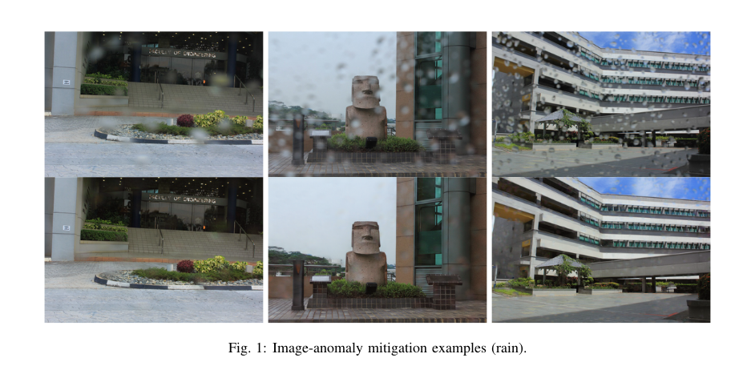
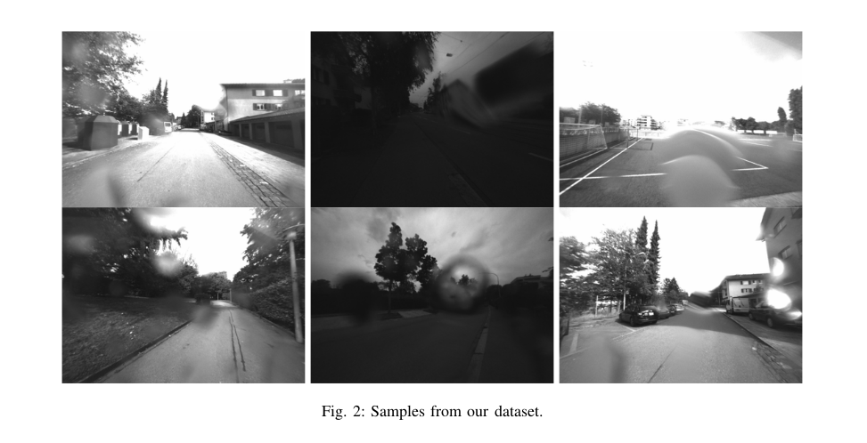

# Fast Image-Anomaly Mitigation for Autonomous Mobile Robots
Created by Gianmario Fumagalli, Yannick Huber, Marcin Dzymcyk, Roland Siegwart and Renaud Dubé.

## Introduction
This work refers to our work, which will appear in IROS 2021. We proposed an architeture for image-anomaly mitigation which can perform in near-real-time.

Camera anomalies like rain or dust can severely degrade image quality and its related tasks, such as localization and segmentation.   
In this work we address this important issue by implementing a pre-processing step that can effectively mitigate such artifacts in a real-time fashion, thus supporting the deployment of autonomous systems with limited compute capabilities.
We propose a shallow generator with aggregation, trained in an adversarial setting to solve the ill-posed problem of reconstructing the occluded regions.
We add an enhancer to further preserve high-frequency details and image colorization.
We also produce one of the largest publicly available datasets to train our architecture and use realistic synthetic raindrops to obtain an improved initialization of the model.
We benchmark our framework on existing datasets and on our own images obtaining state-of-the-art results while enabling real-time performance, with up to 40x faster inference time than existing approaches.

## Dataset

You can find our dataset here: ***link to dataset***
